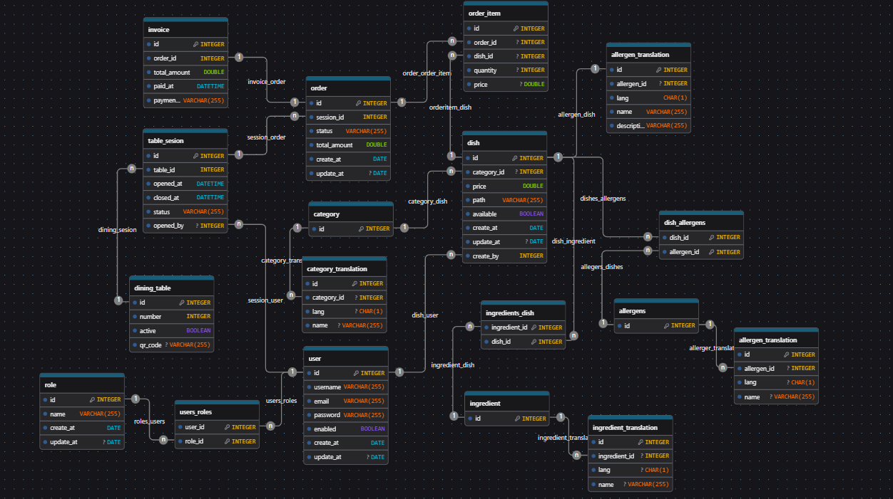

# Restaurant Management API - Database (MySQL)

This document aims to describe how to create the project database, including security, tables, products, and orders.

## Prerequisites

- MySQL installed (version 8.0)
- MySQL user with permissions for:
    - CREATE
    - ALTER
    - DROP
    - REFERENCE
- Any MySQL client that allows running SQL statements

## Create the Database (using Docker)

In this project, the MySQL database runs inside a Docker container.

### Using docker-compose

The configuration is in `restaurant-docker/docker-compose.yml`

#### Example content of `docker-compose.yml`

```
services:
  db:
    image: mysql:8.0
    container_name: restaurant-mysql
    environment:
      MYSQL_ROOT_PASSWORD: supersecret123
      MYSQL_DATABASE: restaurant
      MYSQL_USER: restaurant_user
      MYSQL_PASSWORD: restaurant_pass
    ports:
      - "3306:3306"
    volumes:
      - mysql_data:/var/lib/mysql

volumes:
  mysql_data:
```
> Security Note: The MYSQL_ROOT_PASSWORD in the Docker file is for development purposes only. In production, it is recommended to use secret environment variables.

Start it with: `docker compose up -d`


---

### Database Schema Design (E/R Diagram)


---

## General structure

The database is divided into five modules:

1. Security (users and roles)
2. Restaurant (tables and sessions)
3. Products (dishes, categories, ingredients, allergens)
4. Orders (order)
5. Invoicing  (invoice)

## Table Descriptions

### Security

---

1. users
   - Stores the system users.
   - username and email are unique.
   - enabled indicates whether the user is active.

2. role
   - Defines system roles (ADMIN, STAFF, etc.).

3. user_role
   - A many-to-many intermediate table between users and roles.
---

### Restaurant

---
1. dining_tables
   - Physical restaurant tables.
   - number is the visible number.
   - qr_code contains the unique QR code for the table.

2. table_session
   - Represents an open session at a table.
   - opened_at / closed_at control the service cycle.
   - status: OPEN, CLOSED, etc.
   - opened_by references the user who opened the table.

---

### Products

---

1. category
   - Categories of dishes (Starts, Drinks, Desserts).

2. dish
   - Menu items.
   - price: The current price.
   - available: Indicates if it is available.
   - created_by creator user.

3. ingredient
   - Individual ingredients.

4. allergen
   - List of allergens (gluten, lactose, etc.).

5. ingredient_dish
   - Many-to-many relationship between ingredients and dishes.

6. dish_allergen
   - Many-to-many relationship between dishes and allergens.

---

### Orders

---

1. orders
   - Order associated with a table session.
   - status: PENDING, IN_PROGRESS, PAID, etc.
   - total_amount: total amount.

2. order_item
   - Order detail.
   - Each row represents an ordered dish.
   - quantity.
   - price at the time of ordering.

---

### Invoicing

---

1. invoice
   - Invoice with details of the orders and the amount to be paid.
   - Has a one-to-one relationship with orders (an order can only have one invoice).
   - payment_method: The method by which the customer has paid: CASH, CARD, TRANSFER.
   - created_by: In the case that the person invoicing has an ID.
   - paid_at: Date/time of payment.

---

Important features:

- UNIQUE(order_id) ensures that duplicate invoices are not created.
- If the billing user is deleted, created_by becomes NULL.

---

## SQL Schema Definition

1. Security Module

```mysql
CREATE TABLE users(
    id INT AUTO_INCREMENT PRIMARY KEY ,
    username VARCHAR(50) NOT NULL UNIQUE ,
    email VARCHAR(100) NOT NULL UNIQUE ,
    password VARCHAR(255) NOT NULL ,
    enabled BOOLEAN NOT NULL DEFAULT TRUE,
    created_at DATETIME NOT NULL DEFAULT CURRENT_TIMESTAMP,
    updated_at DATETIME NULL ON UPDATE CURRENT_TIMESTAMP
);
CREATE TABLE roles(
    id INT AUTO_INCREMENT PRIMARY KEY ,
    name VARCHAR(50) NOT NULL UNIQUE ,
    created_at DATETIME NOT NULL DEFAULT CURRENT_TIMESTAMP,
    updated_at DATETIME NULL ON UPDATE CURRENT_TIMESTAMP
);
CREATE TABLE user_role(
    user_id INT NOT NULL,
    role_id INT NOT NULL,
               
    PRIMARY KEY (user_id, role_id),
    CONSTRAINT fk_user
        FOREIGN KEY (user_id)
        REFERENCES users(id)
        ON DELETE CASCADE,
    CONSTRAINT fk_role
        FOREIGN KEY (role_id)
        REFERENCES roles(id)
        ON DELETE CASCADE
);
```

2. Restaurant Module

```mysql
CREATE TABLE dining_tables (
    id INT AUTO_INCREMENT PRIMARY KEY,
    number INT NOT NULL UNIQUE,
    is_active BOOLEAN NOT NULL DEFAULT TRUE,
    qr_code VARCHAR(255) NOT NULL UNIQUE
);

CREATE TABLE table_session (
    id INT AUTO_INCREMENT PRIMARY KEY,
    table_id INT NOT NULL ,
    opened_at DATETIME NOT NULL DEFAULT CURRENT_TIMESTAMP,
    closed_at DATETIME NULL,
    status VARCHAR(20) NOT NULL,
    opened_by INT NULL,
    
    INDEX idx_table_id (table_id),
    INDEX idx_status (status),
    
    CONSTRAINT fk_session_table
        FOREIGN KEY (table_id) REFERENCES dining_tables(id)
        ON DELETE CASCADE,
    CONSTRAINT fk_session_user
        FOREIGN KEY (opened_by) REFERENCES users(id)
        ON DELETE SET NULL
);
```
3. Products Module

```mysql
CREATE TABLE category (
    id INT AUTO_INCREMENT PRIMARY KEY
);

CREATE TABLE dish (
    id INT AUTO_INCREMENT PRIMARY KEY,
    category_id INT NULL,
    price DECIMAL(10, 2) NOT NULL,
    available BOOLEAN NOT NULL DEFAULT TRUE,
    image_path VARCHAR(500) NULL,
    created_at DATETIME NOT NULL DEFAULT CURRENT_TIMESTAMP,
    updated_at DATETIME NULL ON UPDATE CURRENT_TIMESTAMP,
    created_by INT NULL,

    INDEX idx_category_id (category_id),
    INDEX idx_available (available),

    CONSTRAINT fk_product_category
        FOREIGN KEY (category_id) REFERENCES category(id)
        ON DELETE SET NULL,
    CONSTRAINT fk_product_user
        FOREIGN KEY (created_by) REFERENCES users(id)
        ON DELETE SET NULL
);

CREATE TABLE ingredient (
    id INT AUTO_INCREMENT PRIMARY KEY
);

CREATE TABLE allergen (
    id INT AUTO_INCREMENT PRIMARY KEY,
    name VARCHAR(100) NOT NULL UNIQUE
);

CREATE TABLE ingredient_dish (
    ingredient_id INT NOT NULL,
    dish_id INT NOT NULL,

    PRIMARY KEY (ingredient_id, dish_id),
    CONSTRAINT  fk_ingredient
        FOREIGN KEY (ingredient_id) REFERENCES ingredient(id)
        ON DELETE CASCADE,
    CONSTRAINT fk_dish
        FOREIGN KEY (dish_id) REFERENCES dish(id)
        ON DELETE CASCADE
);

CREATE TABLE dish_allergen (
    dish_id INT NOT NULL,
    allergen_id INT NOT NULL,
    
    PRIMARY KEY (dish_id, allergen_id),
    
    CONSTRAINT fk_allergen_dish
        FOREIGN KEY (dish_id) REFERENCES dish(id)
        ON DELETE CASCADE,
    
    CONSTRAINT fk_allergen
        FOREIGN KEY (allergen_id) REFERENCES allergen(id)
        ON DELETE CASCADE
);

```

4. Orders module

```mysql
CREATE TABLE orders(
    id INT AUTO_INCREMENT PRIMARY KEY,
    session_id INT NOT NULL,
    status VARCHAR(20) NOT NULL DEFAULT 'PENDING',
    total_amount DECIMAL(10, 2) NOT NULL DEFAULT 0.00,
    created_at DATETIME NOT NULL DEFAULT CURRENT_TIMESTAMP,
    updated_at DATETIME NULL ON UPDATE CURRENT_TIMESTAMP,
    closed_at DATETIME NULL,

    INDEX idx_session_id (session_id),
    INDEX idx_status (status),

    CONSTRAINT fk_order_session
        FOREIGN KEY (session_id) REFERENCES table_session(id)
        ON DELETE CASCADE
);

CREATE TABLE order_item(
    id INT AUTO_INCREMENT PRIMARY KEY,
    order_id INT NOT NULL,
    dish_id INT NOT NULL,
    quantity INT NOT NULL DEFAULT 1,
    price DECIMAL(10, 2) NOT NULL,
    status VARCHAR(20) NULL,

    INDEX idx_order_id (order_id),
    INDEX idx_status (status),
    
    CONSTRAINT fk_item_order
        FOREIGN KEY (order_id) REFERENCES orders(id)
        ON DELETE CASCADE,
    
    CONSTRAINT fk_item_dish
        FOREIGN KEY (dish_id) REFERENCES dish(id)
        ON DELETE RESTRICT
);

```

5. Invoicing module

```mysql

CREATE TABLE invoice (
    id INT AUTO_INCREMENT PRIMARY KEY,
    order_id INT NULL,
    total_amount DECIMAL(10, 2) NOT NULL,
    paid_at DATETIME NULL,
    payment_method VARCHAR(50) NULL,
    created_by INT NULL,
    
    UNIQUE (order_id),
    
    CONSTRAINT fk_invoice_order
        FOREIGN KEY (order_id) REFERENCES orders(id)
        ON DELETE SET NULL ,
    
    CONSTRAINT fk_invoice_user
        FOREIGN KEY (created_by) REFERENCES users(id)
        ON DELETE SET NULL
);
```

### Translation Tables Structure

- Category translation table

```mysql
CREATE TABLE category_translation (
    id INT AUTO_INCREMENT PRIMARY KEY,
    category_id INT NOT NULL,
    lang CHAR(2) NOT NULL,
    name VARCHAR(100) NOT NULL,

    UNIQUE KEY category_language (category_id, lang),

    CONSTRAINT fk_category_translation
        FOREIGN KEY (category_id) REFERENCES category(id)
        ON DELETE CASCADE
);
```

- Dish translation table

```mysql
CREATE TABLE dish_translation (
    id INT AUTO_INCREMENT PRIMARY KEY,
    dish_id INT NOT NULL,
    lang CHAR(2) NOT NULL,
    name VARCHAR(150) NOT NULL,
    description TEXT NOT NULL,

    UNIQUE KEY dish_language(dish_id, lang),
    UNIQUE KEY uk_name_lang (name, lang),

    CONSTRAINT fk_dish_translation
    FOREIGN KEY (dish_id) REFERENCES dish(id)
        ON DELETE CASCADE
);
```

- Ingredient translation

```mysql
CREATE TABLE ingredient_translation (
    id INT AUTO_INCREMENT PRIMARY KEY,
    ingredient_id INT NOT NULL,
    lang CHAR(2) NOT NULL,
    name VARCHAR(100) NOT NULL,
    
    UNIQUE KEY ingredient_language (ingredient_id, lang),
    UNIQUE KEY uk_name_lang (name, lang),
    
    CONSTRAINT fk_ingredient_translation
        FOREIGN KEY (ingredient_id) REFERENCES ingredient(id)
        ON DELETE CASCADE
);
```

- Allergen translation

```mysql
CREATE TABLE allergen_translation (
    id INT AUTO_INCREMENT PRIMARY KEY,
    allergen_id INT NOT NULL,
    lang CHAR(2) NOT NULL,
    name VARCHAR(100) NOT NULL,

    UNIQUE KEY allergen_language (allergen_id, lang),
    UNIQUE KEY uk_name_lang (name, lang),

    CONSTRAINT fk_allergen_translation
        FOREIGN KEY (allergen_id) REFERENCES allergen(id)
        ON DELETE CASCADE
);
```
